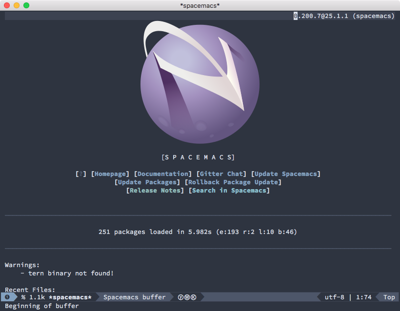
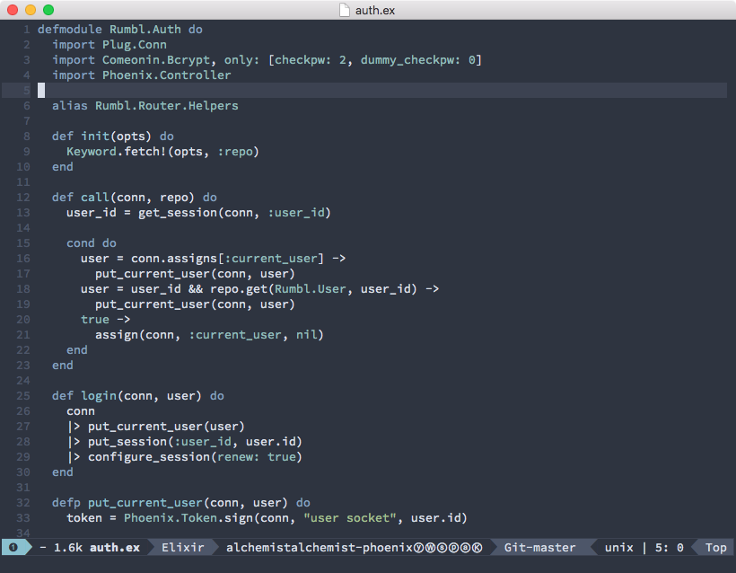
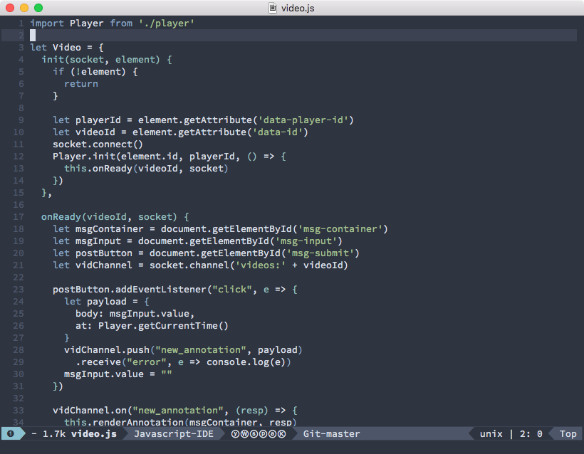
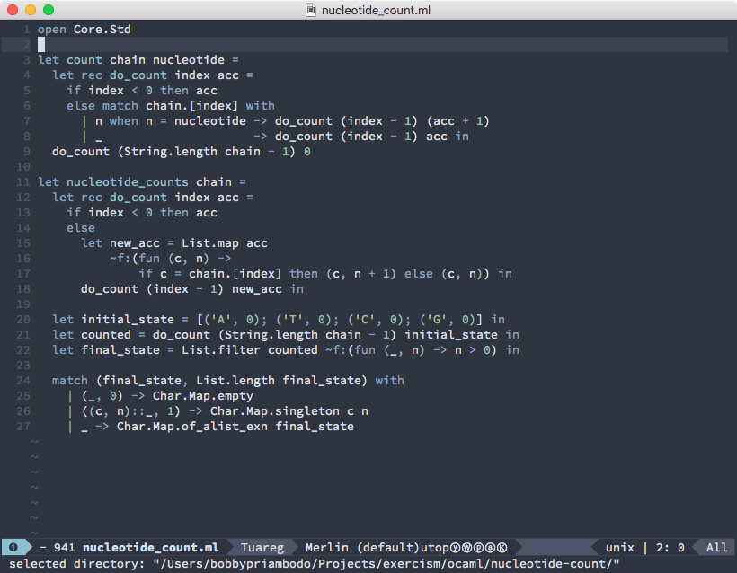
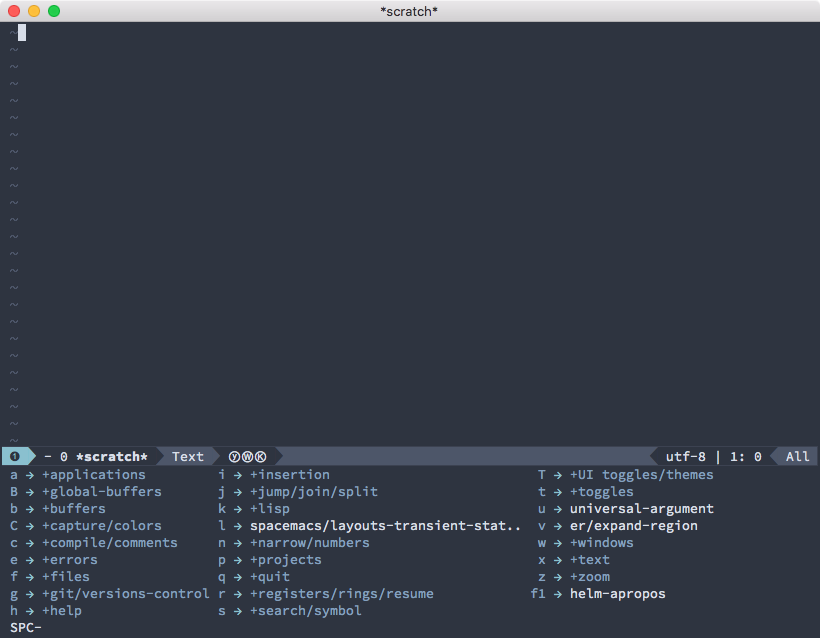

# Nord theme for Spacemacs (Unofficial)

This is an unofficial port of [Nord color palette](https://github.com/arcticicestudio/nord) for [Spacemacs](https://github.com/syl20bnr/spacemacs).

The official Emacs port of Nord is [still being postponed](https://github.com/arcticicestudio/nord/issues/6), and I took the liberty of creating one for my own use. This repo is meant to be retired should the official port come into fruition in the future.

This base template of this theme is generated from [ThemeCreator](https://github.com/mswift42/themecreator).

## Supported languages

As of now, here are the languages that I have tested this theme with:

* Elixir (including EEX templates)
* Javascript, JSX
* HTML
* OCaml

## Usage

I can't seem to find a straightforward way to add local theme to Spacemacs. Here is the not-so-straightforward method:

1. Clone this repo to, say, `~/Projects/nord-spacemacs`

2. Symlink the `nord-theme.el` to `~/.emacs.d`

    ```
    $ cd ~/.emacs.d
    $ ln -s ~/Projects/nord-spacemacs/nord-theme.el nord-theme.el
    ```

3. Add the `nord` theme to `dotspacemacs-themes`

    ```
    dotspacemacs-themes '(nord
                          spacemacs-dark
                          spacemacs-light)
    ```

4. Restart your Spacemacs!

## Screenshots

**Spacemacs Buffer**



**Elixir**



**Javascript**



**OCaml**



**Which Key (`SPC`)**



## Known issues

This theme only works for the GUI version of Emacs/Spacemacs.
